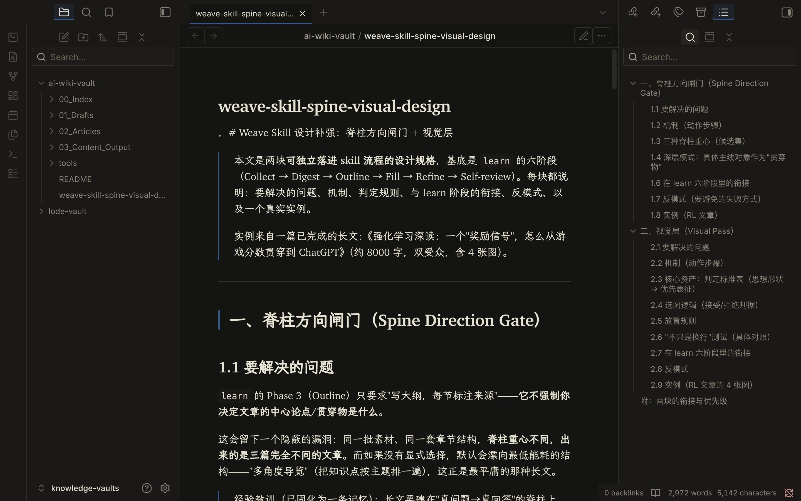
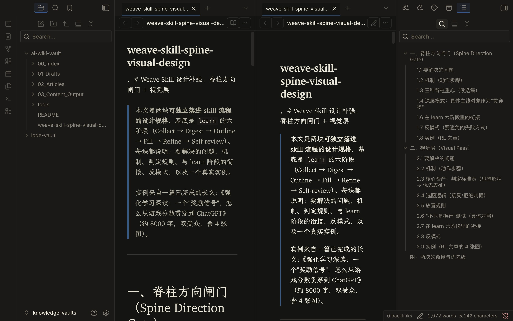
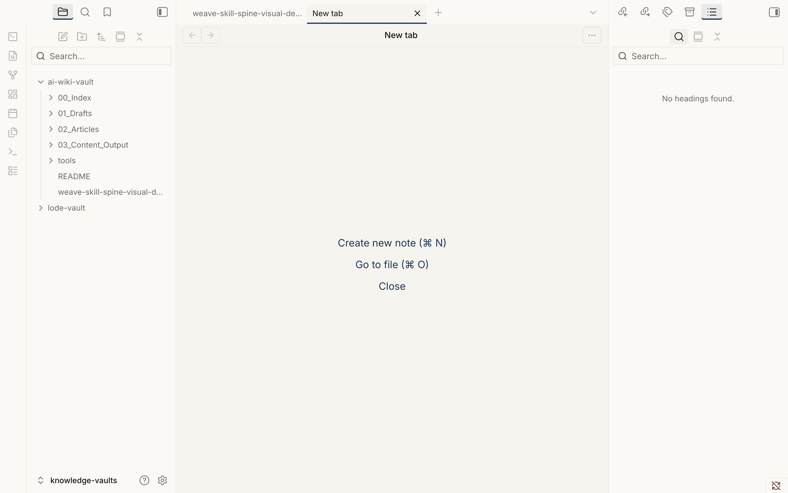
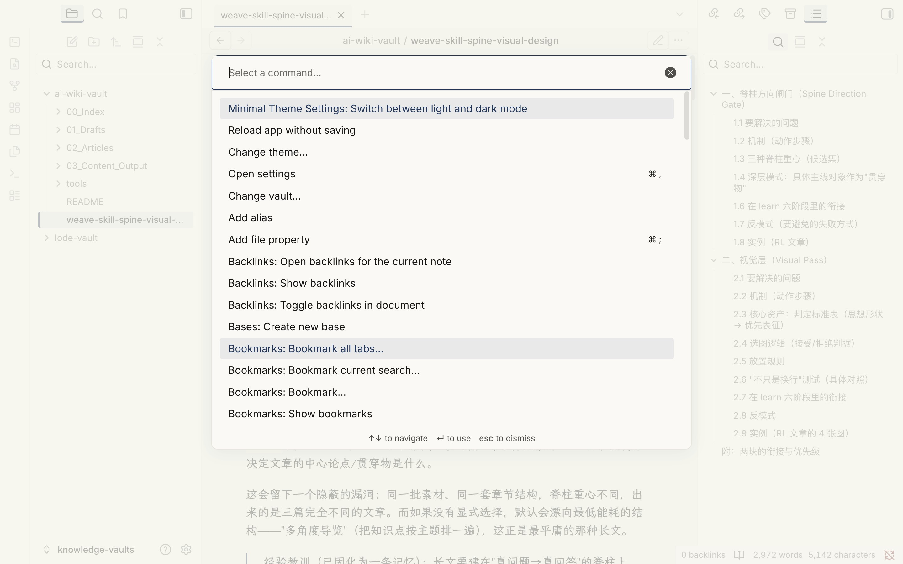
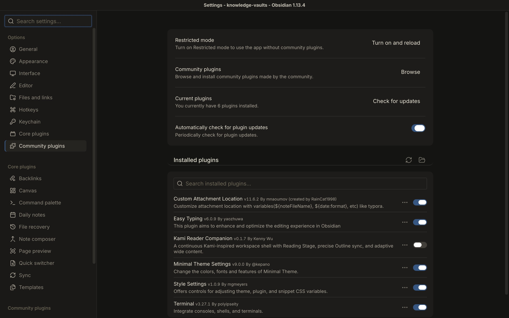

# Kami Reader Companion

[English](./README.md) | [简体中文](./README.zh-CN.md)

A desktop-first Obsidian 1.13+ plugin that keeps the workspace on one continuous
Kami-inspired Folio Shell across New Tab, Reading, Editing, Graph, Canvas, and
other root views. Active Markdown views additionally receive:

- continuous Reading and Editing presentation;
- exact current-heading highlighting in the core Outline when its rendered rows
  map uniquely to note headings, with native highlighting as the safe fallback;
- adaptive use of spare pane width for wide diagrams, tables, code and embeds;
- an explicit **Toggle reading stage** command for deep Reading View;
- an optional **Toggle focus mode** command that follows the active editor line
  and reveals Reading blocks through pointer or keyboard focus.

The plugin is desktop-only, targets Obsidian 1.13+, and works with Obsidian's
Default Theme. It does not require
[Kami Reader](https://github.com/KKenny0/obsidian-kami). Kami Reader remains an
optional companion for fuller styling of callouts, tables, code, editor syntax,
menus, settings, and other components outside Companion's document treatment.
No theme detection or integration setting is required.

Companion writes no note content, stores no workspace state, and restores the
active theme when disabled.

## Reading Stage and Focus Mode

Open the Command Palette and run **Kami Reader Companion: Toggle focus mode**
to enter the optional focus treatment in either Editing or Reading View. In
Editing View it follows CodeMirror's active line. In Reading View, point to or
keyboard-focus a block to bring it and its neighbors forward; use `Arrow Up`
and `Arrow Down` to move between blocks. Workspace chrome returns to full
contrast-safe throughout; hovered, active, or keyboard-focused controls become
the strongest chrome within their group.

**Toggle reading stage** remains Reading-only and changes the workspace's
spatial presentation. The two modes can be combined: Reading Stage controls
space, while Focus Mode controls attention. `Escape` exits Reading Stage first,
then Focus Mode. Neither mode is persisted.

The visual baseline is a real-app matrix captured from Obsidian 1.13.4 on macOS
at a 1440x900 logical viewport (Retina 2x). Its 22 manually inspected states
cover Default and Kami Reader themes, light and dark color schemes, Reading and
Editing, single and split layouts, Focus Mode, Reading Stage, New Tab, Settings,
Command Palette, Quick Switcher, context menus, notices, Search, and secondary
panes. `npm run check:visual` verifies that the reviewed screenshots remain bound
to the exact release assets; it does not replace human bitmap review.

## Showcase

### One visual language across Reading and Editing

| Reading View · Dark | Editing View · Dark · Split |
|---|---|
|  |  |

### The shell stays continuous beyond the document

| New Tab · Light | Reading Stage · Light |
|---|---|
|  |  |

### Foregrounds and settings remain part of the same workspace

| Command Palette · Light | Settings · Dark |
|---|---|
|  |  |

## Local development

```sh
npm ci
npm run check
npm run check:visual
npm run dev:injector
```

Paste `.dev/inject-kami-reader-companion.js` into Obsidian DevTools, then enable
**Kami Reader Companion** under Settings → Community plugins.

The injector intentionally refuses to update an existing plugin directory.
Remove the previous local installation before injecting a new build.
