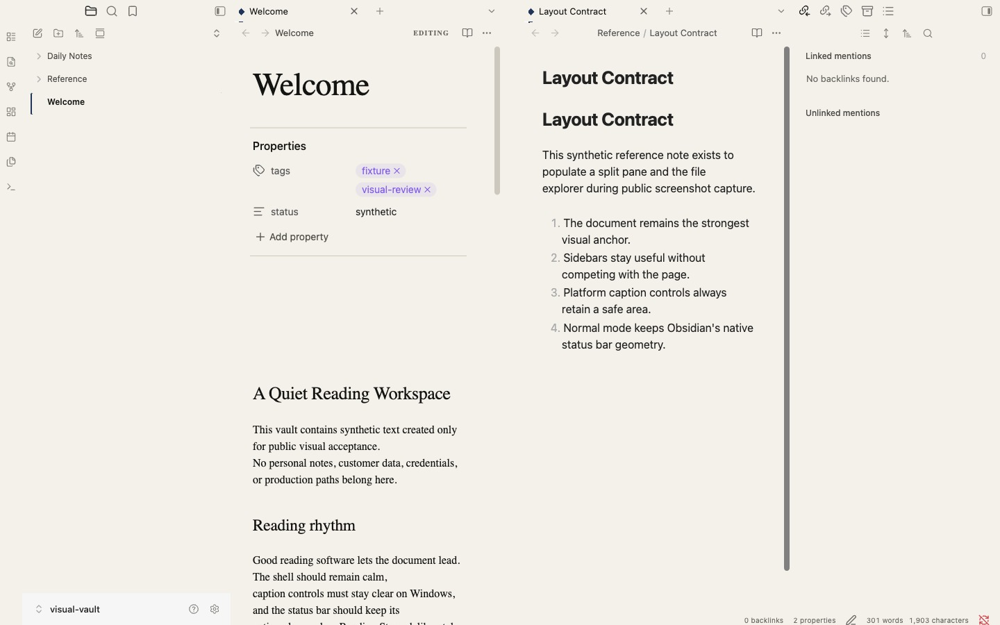
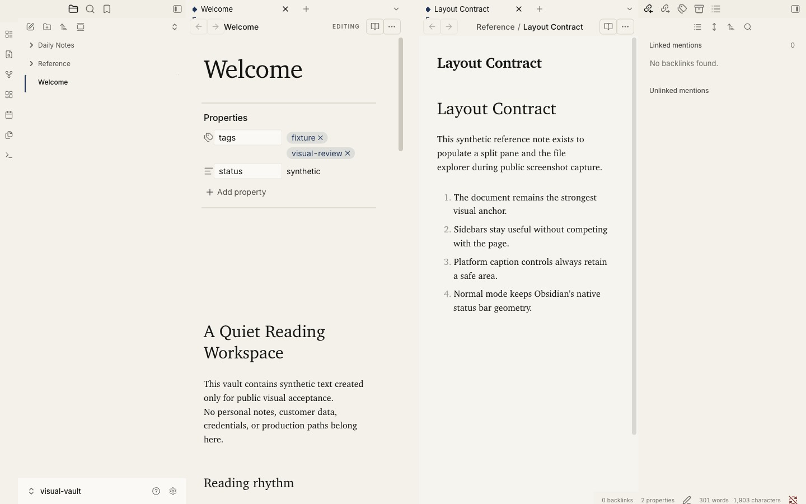
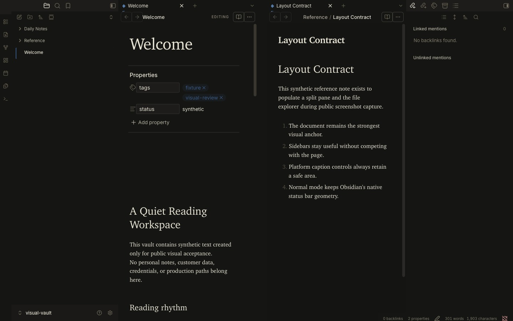
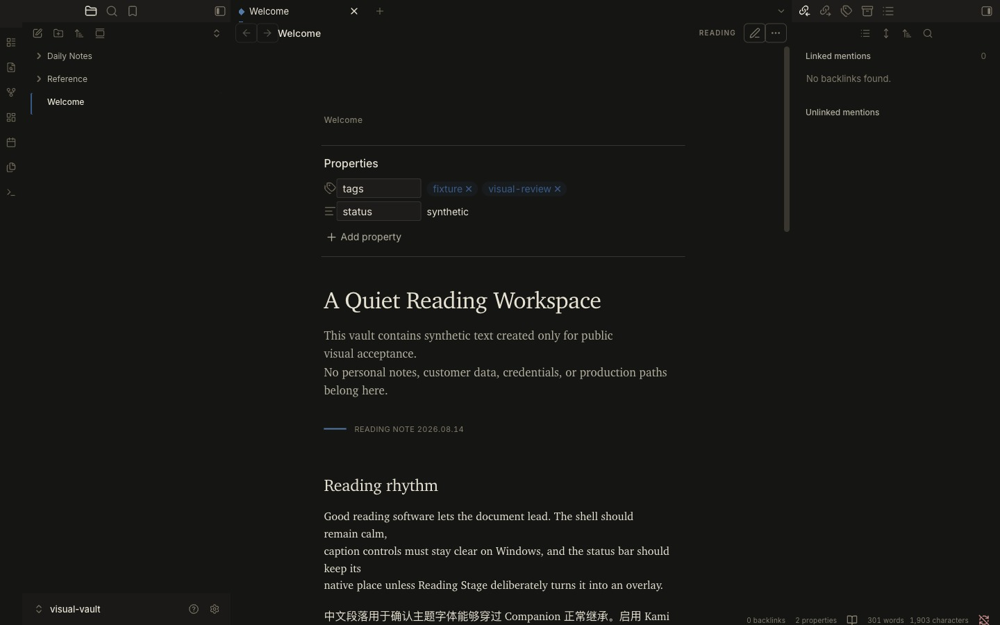
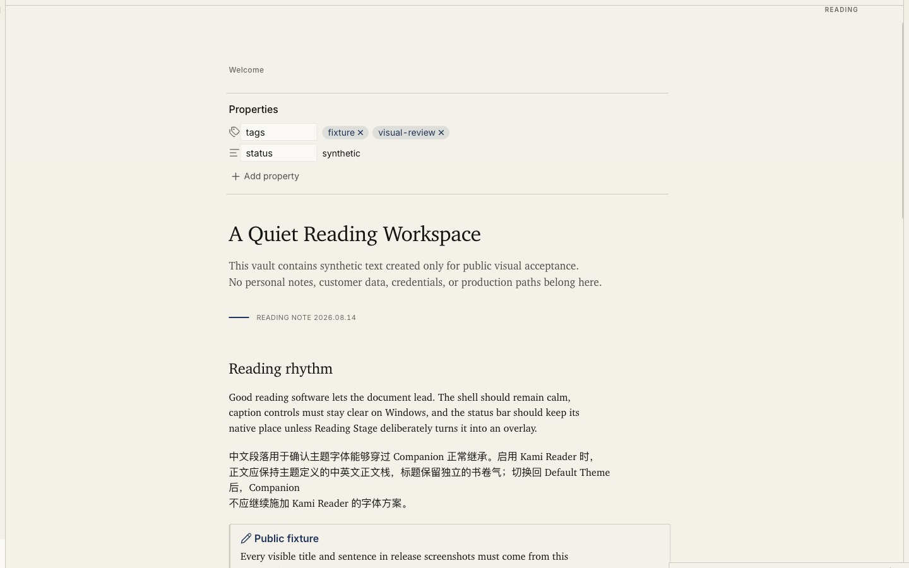
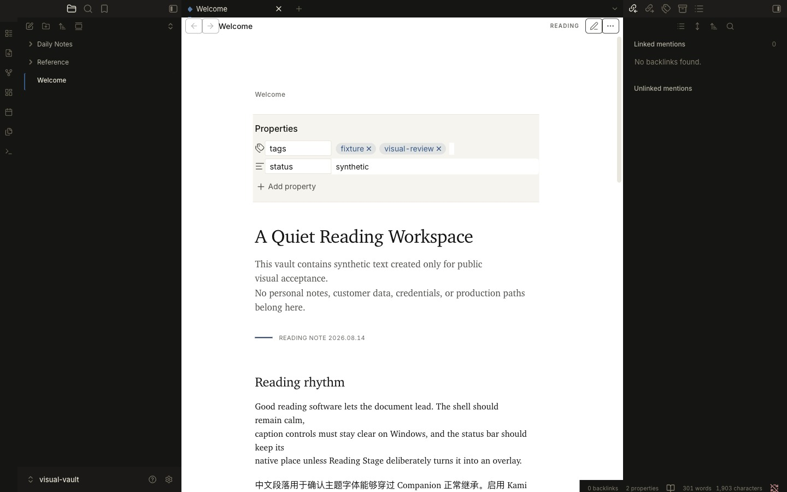

# Kami Reader Companion

[English](./README.md) | [简体中文](./README.zh-CN.md)

A desktop-first Obsidian 1.13+ plugin that keeps the workspace on one continuous
Kami-inspired Folio Shell across New Tab, Reading, Editing, Graph, Canvas, and
other root views. Markdown pane typography stays stable across focus changes;
the current document additionally receives:

- continuous Reading and Editing presentation;
- exact current-heading highlighting in the core Outline when its rendered rows
  map uniquely to note headings, with native highlighting as the safe fallback;
- adaptive use of spare pane width for wide diagrams, tables, code and embeds;
- an explicit **Toggle reading stage** command for deep Reading View;
- an optional **Toggle focus mode** command that follows the active editor line
  and reveals Reading blocks through pointer or keyboard focus;
- a transient **Toggle white page preview** command for printing-minded review
  of one active Markdown document without changing the surrounding shell.

The plugin is desktop-only, targets Obsidian 1.13+, and works with Obsidian's
Default Theme. It does not require
[Kami Reader](https://github.com/KKenny0/obsidian-kami). Kami Reader remains an
optional companion for fuller styling of callouts, tables, code, editor syntax,
menus, settings, and other components outside Companion's document treatment.
No theme detection or integration setting is required.

Companion writes no note content, stores no workspace state, and restores the
active theme when disabled.

Version 0.4.0 has maintainer acceptance on macOS and an explicitly approved
single-platform release exception. **Windows and Linux are not validated for this
version.** Ticket 07 remains open; the 0.3.2 screenshots below are historical.
See the [release notes](./docs/releases/0.4.0.md) and [acceptance record](./docs/workspace-phase2-review.md).

Pane focus does not change document typography or add an automatic deck or date.
Companion and Reading Stage respect user font, maximum width, background, and
accent settings. White-page preview temporarily overrides only the active document palette.

## Reading Stage, Focus Mode, and White Page Preview

Open the document's **More options (⋯)** menu to toggle Reading Stage, Focus Mode,
and White page preview. Checkmarks reflect current state; existing commands remain
available. Each active mode has its own exit button in the document header. In a
narrow pane, use Tab to reach each button and Enter or Space to exit. Escape closes
foreground menus or dialogs before exiting Stage, then Focus.

Pane width controls whitespace and heading scale without shrinking the user's body
font. Wide content uses spare pane space; nested list and callout content stays local.

Open the Command Palette and run **Kami Reader Companion: Toggle focus mode**
to enter the optional focus treatment in either Editing or Reading View. In
Editing View it follows CodeMirror's active line. In Reading View, point to or
keyboard-focus a block to bring it and its neighbors forward; use `Arrow Up`
and `Arrow Down` to move between blocks. Workspace chrome remains
contrast-safe throughout; hovered, active, or keyboard-focused controls become
the strongest chrome within their group. Reference panes and surrounding text
retain full readability; markers emphasize the current content.

Focus is temporary per-window intent: it survives Markdown file, pane, and
Reading/Editing changes, pauses on Graph, Canvas, or New Tab, and resumes on
Markdown. Windows are independent. Explicit exit, Escape, window close, or
plugin unload clears it; restarting does not restore it.

**Toggle reading stage** remains Reading-only and changes the workspace's
spatial presentation. The two modes can be combined: Reading Stage controls
space, while Focus Mode controls attention. `Escape` exits Reading Stage first,
then Focus Mode. Neither mode is persisted.

Run **Kami Reader Companion: Toggle white page preview** in either Reading or
Editing View to make only the active Markdown leaf use white paper, dark ink,
Ink Blue accents, and warm parchment document surfaces. It composes with Stage
and Focus, has no default hotkey or Ribbon button, and clears when the active
file, leaf, mode, or owner window changes, or when Companion unloads. It never
writes frontmatter or saved plugin data. The same light reset also protects
Obsidian PDF export when the app is in Dark mode.

Historical screenshots and fingerprints remain unchanged. The 0.4.0 release check
binds its assets to the reviewed implementation and the paired Kami Reader 0.3.1
theme file. `npm run check:release` validates this approved exception;
`npm run check:visual` retains the full visual matrix gate. Later versions do not
inherit the exception.

## Showcase

### One Field works with Default and Kami Reader

| Default · Light · Editing Split | Kami Reader · Light · Editing Split |
|---|---|
|||

### Reading and Editing share the same dark field

| Kami Reader · Dark · Editing Split | Kami Reader · Dark · Reading |
|---|---|
|||

### Stage and white-page preview keep intentional boundaries

| Reading Stage · Light | White-page Preview · Dark |
|---|---|
|||

## Local development

```sh
npm ci
npm run check
npm run dev:injector
```

`check:visual` also needs the exact paired theme asset:

```sh
KAMI_VISUAL_THEME_CSS=/path/to/obsidian-kami-0.3.1/theme.css \
npm run check:release
```

On PowerShell, set `$env:KAMI_VISUAL_THEME_CSS` to the same `theme.css` path
before running `npm run check:visual`.

Release screenshots must contain only files and text from
`tests/fixtures/visual-vault`; never capture a personal or production vault.

Companion inherits native `--font-text` (falling back to `--font-text-theme`)
for body copy and the optional
`--font-heading-theme` contract for headings. Themes without the heading token,
including Obsidian Default, safely fall back to their body font.

Paste `.dev/inject-kami-reader-companion.js` into Obsidian DevTools, then enable
**Kami Reader Companion** under Settings → Community plugins.

The injector intentionally refuses to update an existing plugin directory.
Remove the previous local installation before injecting a new build.
