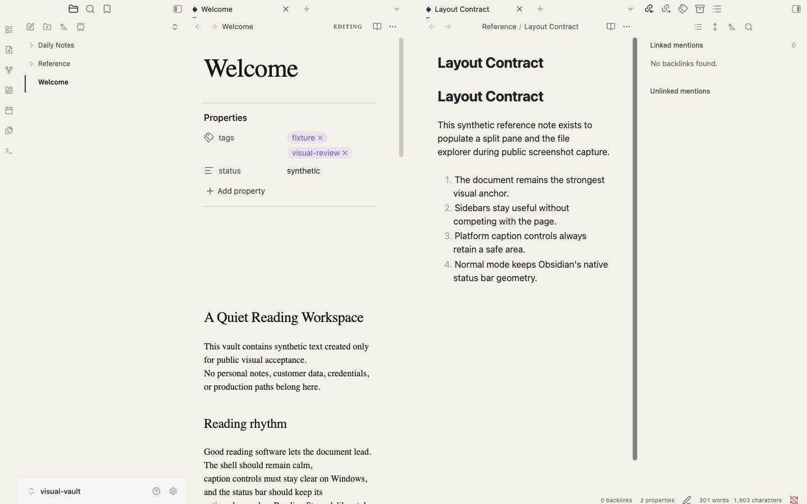
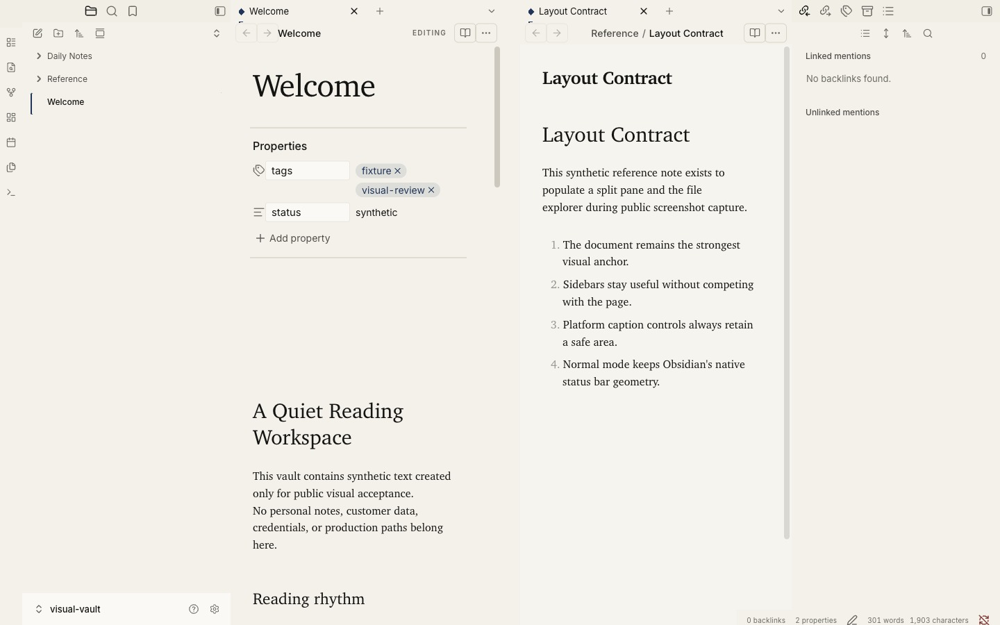
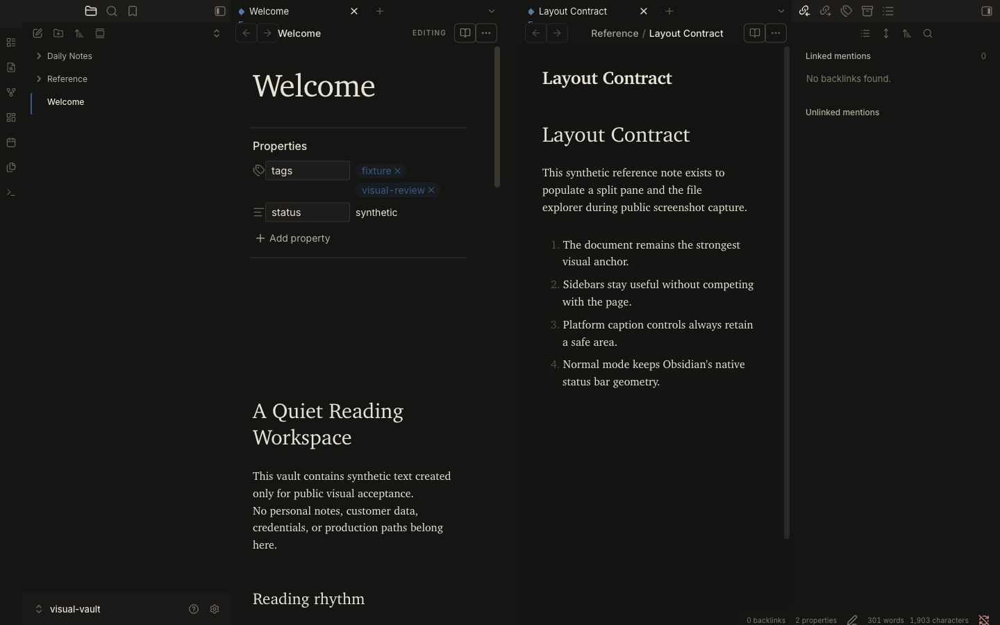
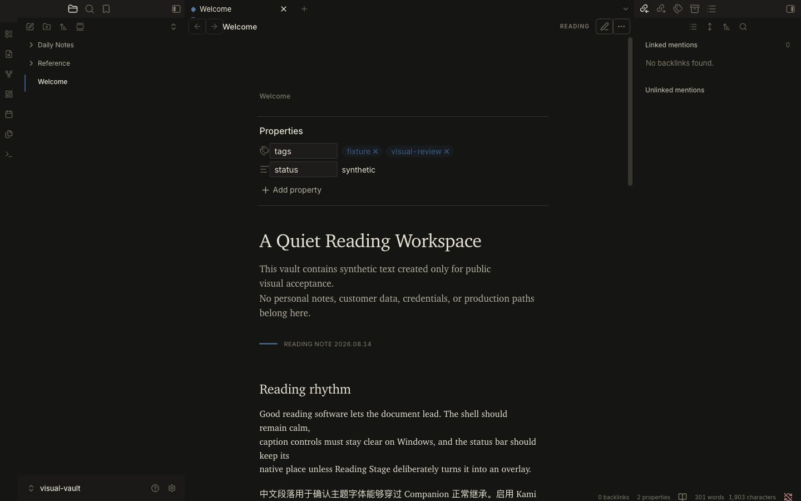
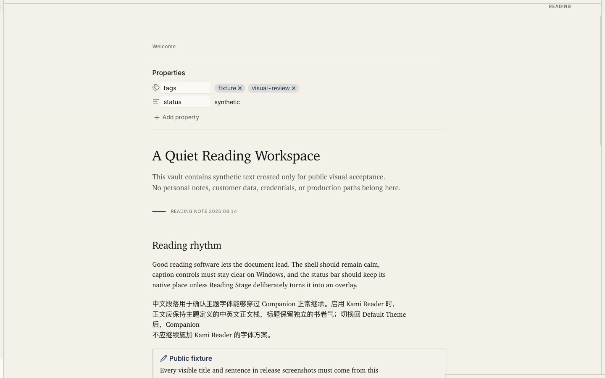
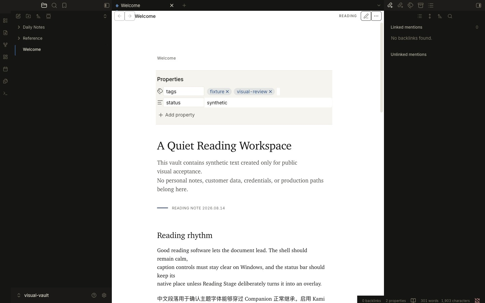

# Kami Reader Companion

[English](./README.md) | 简体中文

一个桌面优先、面向 Obsidian 1.13+ 的插件。它让 New Tab、Reading、Editing、
Graph、Canvas 以及其他根视图共享同一套受 Kami 启发的连续 Folio Shell。
当前 Markdown 视图还会获得：

- 连贯一致的 Reading 与 Editing 呈现；
- 当 Outline 可唯一映射到笔记标题时精确高亮当前标题；无法可靠映射时安全退回
  原生高亮；
- 自适应利用 pane 的剩余宽度，容纳宽图、表格、代码和嵌入内容；
- 显式的 **Toggle reading stage** 命令，用于进入深度 Reading View；
- 可选的 **Toggle focus mode** 命令，在 Editing View 跟随当前编辑行，
  在 Reading View 通过指针或键盘焦点突出当前内容块；
- 瞬时的 **切换白纸预览（Toggle white page preview）** 命令，只把当前 Markdown
  文档切到适合打印检查的白纸，不改变周围 Workspace 外壳。

本插件仅支持桌面端，适用于 Obsidian 1.13+，并兼容 Obsidian Default Theme。
它不依赖 [Kami Reader](https://github.com/KKenny0/obsidian-kami)。Kami Reader
是可选搭配，可进一步统一 callout、表格、代码、编辑器语法、菜单、设置面板，
以及 Companion 文档处理范围之外的其他组件。无需主题检测或额外的集成设置。

Companion 不会写入笔记内容，也不会保存工作区状态；禁用后会恢复当前主题。

## Reading Stage、Focus Mode 与白纸预览

打开 Command Palette，执行 **Kami Reader Companion: Toggle focus mode**，
即可在 Editing 或 Reading View 进入可选的专注模式。Editing View 会跟随
CodeMirror 当前编辑行；Reading View 会突出指针或键盘焦点所在的内容块及其
相邻内容，并可通过 `Arrow Up`、`Arrow Down` 在内容块之间移动。侧栏、Ribbon、
标签栏和状态栏始终保持安全对比度；hover、激活或键盘聚焦的控件会成为组内最强层级。

**Toggle reading stage** 仍然只作用于 Reading View，负责改变工作区的空间呈现。
两种模式可以组合：Reading Stage 管理空间，Focus Mode 管理注意力。按下
`Escape` 会先退出 Reading Stage，再退出 Focus Mode。两种模式均不会持久化。

在 Reading 或 Editing View 执行 **Kami Reader Companion: Toggle white page
preview（切换白纸预览）**，只有当前 Markdown leaf 会切到白纸、深色墨迹、油墨蓝
强调色，以及保留暖米纸的卡片/代码等文档表面。它可与 Stage、Focus 叠加，没有
默认快捷键或 Ribbon 按钮；切换文件、leaf、模式、owner window 或卸载插件时会
自动清除。它不会写 frontmatter，也不会保存插件数据。相同的亮色 reset 也会在
Obsidian 处于深色模式时保护 PDF 导出。

旧版 macOS 和 Windows 矩阵仅保留为历史参考，不计入当前发布验收。0.3.0
使用隔离的真实 Obsidian 1.13.7 进程和受版本控制的合成 `visual-vault`，完成了
10 张当前 macOS 候选截图。截图覆盖 Default 与 Kami Reader、明暗配色、
Reading 与 Editing、单双 pane、双 pane Focus、Reading Stage，以及 Default Dark 与 Kami
Reader Dark 下的白纸预览。双 pane 截图还验证了 26px 留白沟槽。门禁把人工审过
的像素绑定到 Companion 发布资产，以及配套的 Kami Reader 0.3.0 候选
`theme.css`。发布工作流从 `0.3.0` 标签获取同一份主题资产；Reader 标签不存在时，
Companion 发布会直接失败。自动检查负责结构和来源，不能替代人工像素审查。

## 效果展示

### Default 与 Kami Reader 都使用 One Field

| Default · 浅色 · 双 pane 编辑 | Kami Reader · 浅色 · 双 pane 编辑 |
|---|---|
|  |  |

### Reading 与 Editing 共享同一个深色纸面场

| Kami Reader · 深色 · 双 pane 编辑 | Kami Reader · 深色 · Reading |
|---|---|
|  |  |

### Reading Stage 与白纸预览保留必要边界

| Reading Stage · 浅色 | 白纸预览 · 深色 |
|---|---|
|  |  |

## 本地开发

```sh
npm ci
npm run check
npm run dev:injector
```

`check:visual` 还需要指定完全一致的配套主题资产：

```sh
KAMI_VISUAL_THEME_CSS=/path/to/obsidian-kami-0.3.0/theme.css \
npm run check:visual
```

在 PowerShell 中，请先把 `$env:KAMI_VISUAL_THEME_CSS` 设为同一份 `theme.css`
路径，再运行 `npm run check:visual`。

发布截图只能展示 `tests/fixtures/visual-vault` 中的文件与文字；严禁捕获个人或
生产知识库。

Companion 的正文继承 `--font-text-theme`，标题优先继承可选的
`--font-heading-theme`；Obsidian Default 等未提供标题 token 的主题会安全回退到
正文字体。

将 `.dev/inject-kami-reader-companion.js` 粘贴到 Obsidian DevTools，然后在
Settings → Community plugins 中启用 **Kami Reader Companion**。

注入脚本会有意拒绝更新已经存在的插件目录。注入新构建前，请先删除之前的
本地安装。
