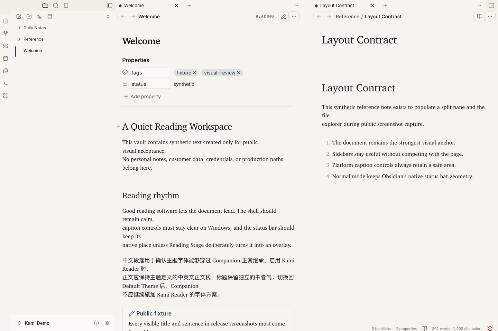
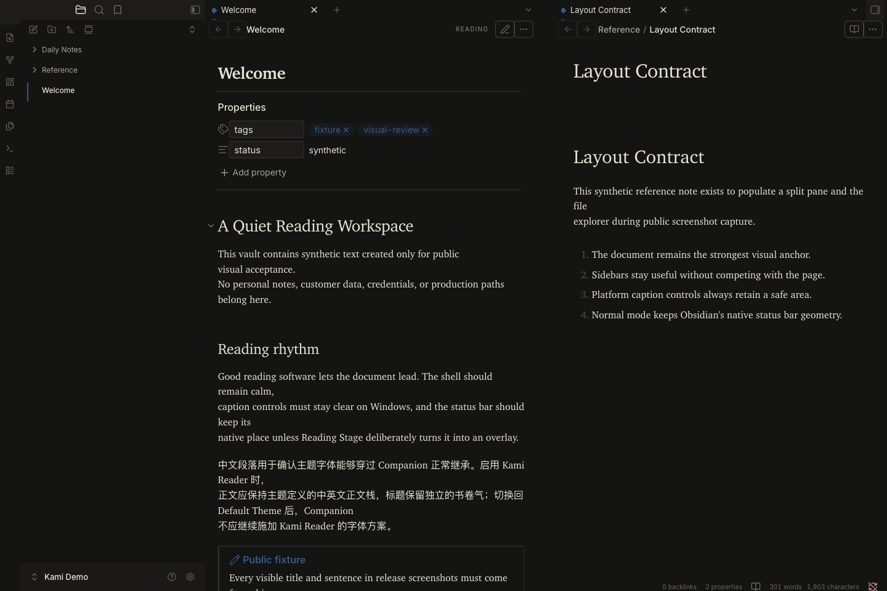
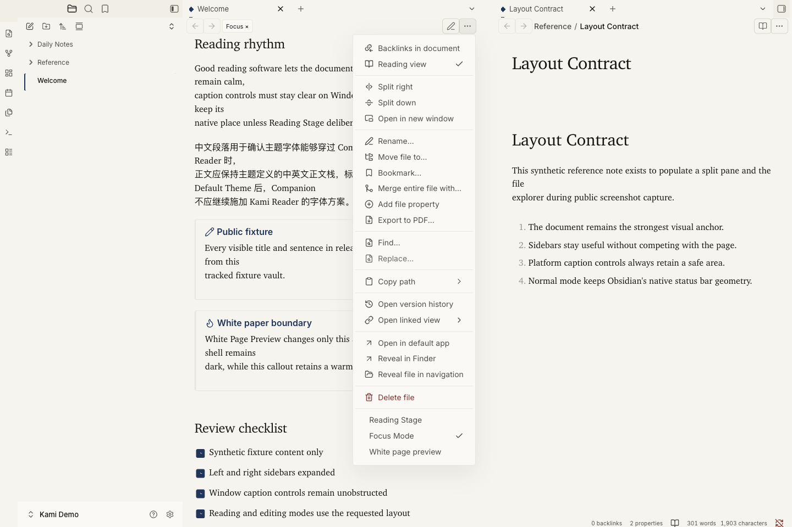
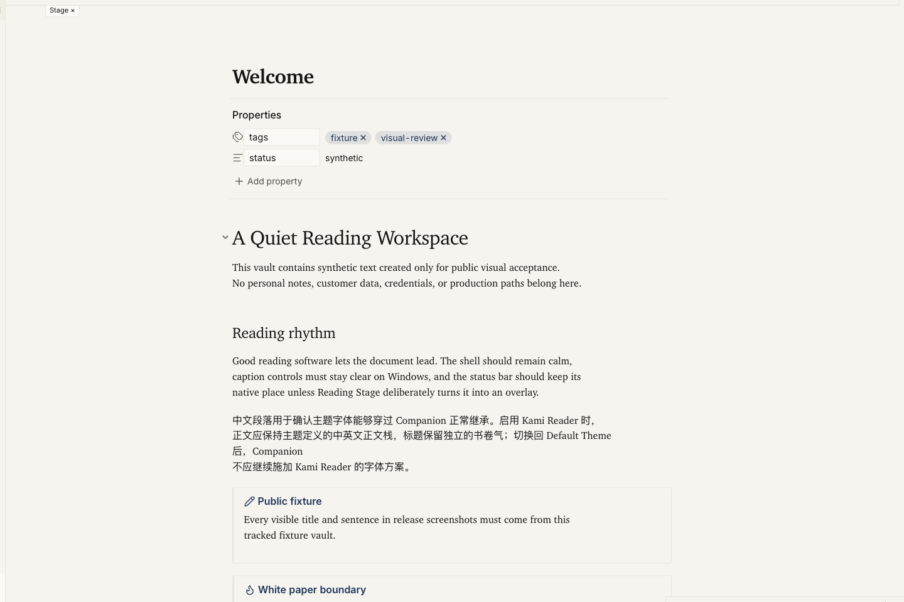
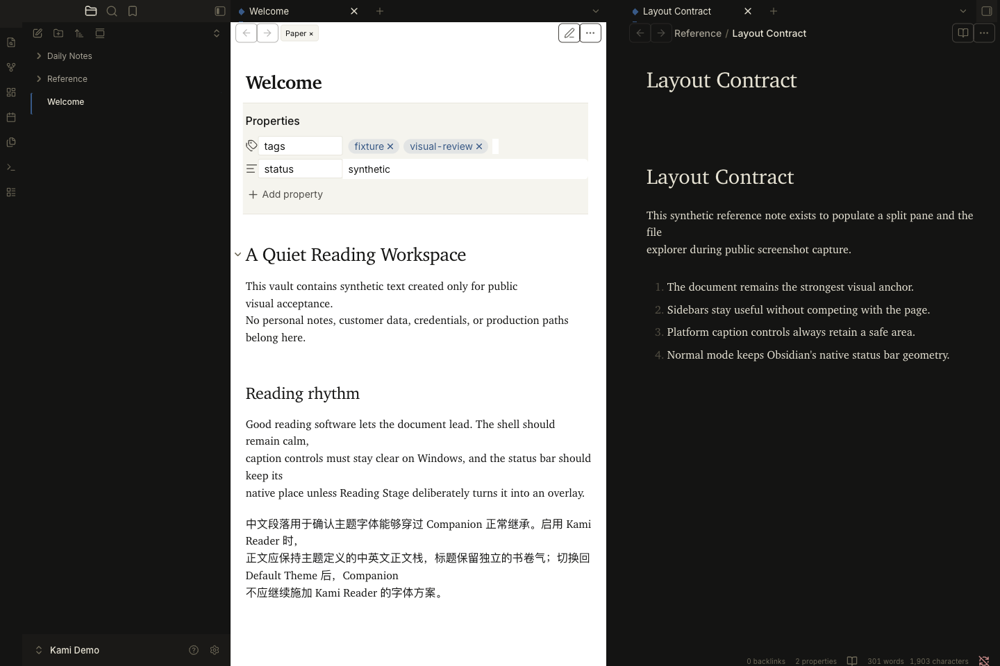
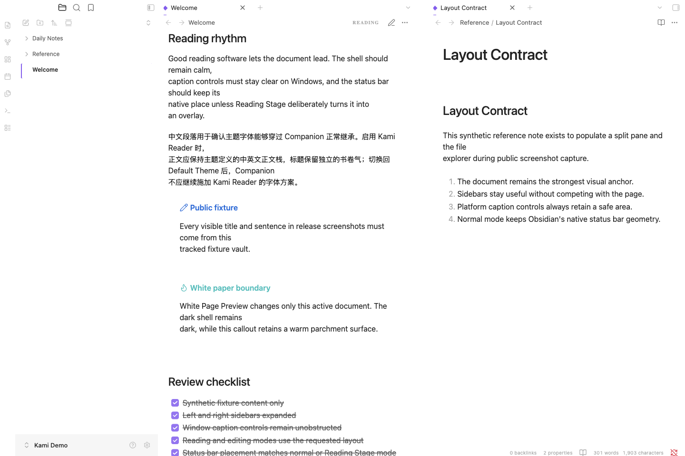

# Kami Reader Companion

[English](./README.md) | 简体中文

一个桌面优先、面向 Obsidian 1.13+ 的插件。它让 New Tab、Reading、Editing、
Graph、Canvas 以及其他根视图共享同一套受 Kami 启发的连续 Folio Shell。
所有 Markdown pane 保持稳定排版；当前文档还会获得：

- 连贯一致的 Reading 与 Editing 呈现；
- 当 Outline 可唯一映射到笔记标题时精确高亮当前标题；无法可靠映射时安全退回
  原生高亮；
- 自适应利用 pane 的剩余宽度，容纳宽图、表格、代码和嵌入内容；
- 显式的 **Toggle reading stage** 命令，用于进入深度 Reading View；
- 可选的 **Toggle focus mode** 命令，在 Editing View 跟随当前编辑行，
  在 Reading View 通过指针或键盘焦点突出当前内容块；
- 瞬时的 **切换白纸预览（Toggle white page preview）** 命令，只把当前 Markdown
  文档切到适合打印检查的白纸，不改变周围 Workspace 外壳。

本插件仅支持桌面端，适用于 Obsidian 1.13+，并兼容 Obsidian Default Theme。
它不依赖 [Kami Reader](https://github.com/KKenny0/obsidian-kami)。Kami Reader
是可选搭配，可进一步统一 callout、表格、代码、编辑器语法、菜单、设置面板，
以及 Companion 文档处理范围之外的其他组件。无需主题检测或额外的集成设置。

Companion 不会写入笔记内容，也不会保存工作区状态；禁用后会恢复当前主题。

0.4.1 已获维护者 macOS 实机验收，并经明确授权按单平台验收例外发布。
**Windows 和 Linux 尚未完成当前版本实机验收。** 07 仍保持未完成。见 [发布说明](./docs/releases/0.4.1.md)和[验收记录](./docs/workspace-phase2-review.md)。

正文排版不随活动焦点改变，不自动添加导语或阅读日期。Companion 与 Reading Stage
继承用户的字体、宽度上限、背景和强调色；白纸预览仅临时覆盖当前文档配色。

## Reading Stage、Focus Mode 与白纸预览

打开文档右上角的 **更多选项（⋯）**，可切换 Reading Stage、Focus Mode 和
White page preview；勾选表示实际状态，原有命令仍可使用。开启后，页头提供
各模式的独立退出按钮。窄 pane 中可用 Tab 切换按钮，按 Enter 或 Space 退出。
菜单或弹窗优先处理 Escape，关闭后再按 Escape 才退出 Stage、Focus。

正文留白与标题尺度随 pane 宽度调整，正文字号保持用户设置。宽内容使用 pane
的剩余空间，嵌套列表和 callout 内的内容保持局部边界。

打开 Command Palette，执行 **Kami Reader Companion: Toggle focus mode**，
即可在 Editing 或 Reading View 进入可选的专注模式。Editing View 会跟随
CodeMirror 当前编辑行；Reading View 会突出指针或键盘焦点所在的内容块及其
相邻内容，并可通过 `Arrow Up`、`Arrow Down` 在内容块之间移动。侧栏、Ribbon、
标签栏和状态栏始终保持安全对比度；hover、激活或键盘聚焦的控件会成为组内最强层级。
参考 pane 与周边正文保持完整可读性，当前内容通过标记强调。

Focus 是窗口内的临时工作状态：切换 Markdown 文件、pane 或阅读／编辑时继续
生效；进入 Graph、Canvas 或 New Tab 时暂停强调，返回后恢复。各窗口独立；
关闭 Focus、按 Escape、关闭窗口或卸载插件时清理，重启后不恢复。

**Toggle reading stage** 仍然只作用于 Reading View，负责改变工作区的空间呈现。
两种模式可以组合：Reading Stage 管理空间，Focus Mode 管理注意力。按下
`Escape` 会先退出 Reading Stage，再退出 Focus Mode。两种模式均不会持久化。

在 Reading 或 Editing View 执行 **Kami Reader Companion: Toggle white page
preview（切换白纸预览）**，只有当前 Markdown leaf 会切到白纸、深色墨迹、油墨蓝
强调色，以及保留暖米纸的卡片/代码等文档表面。它可与 Stage、Focus 叠加，没有
默认快捷键或 Ribbon 按钮；切换文件、leaf、模式、owner window 或卸载插件时会
自动清除。它不会写 frontmatter，也不会保存插件数据。相同的亮色 reset 也会在
Obsidian 处于深色模式时保护 PDF 导出。

历史截图和指纹保持原样。0.4.1 的发布校验绑定当前插件资产、已复审实现和
配套 Kami Reader 0.3.1 的主题文件，不将旧截图计入新验收。
`npm run check:release` 校验本次经授权的例外；`npm run check:visual` 仍保留完整
视觉矩阵门禁。本次例外不会自动延续到后续版本。

## 效果展示

以下为当前版本的 macOS 实机截图，使用合成示例笔记。Obsidian 1.13.7，Kami Reader 0.3.1，Companion 0.4.1；最后一张使用 Default 主题。

| 阅读与布局 | 交互与细节 |
|---|---|
| **浅色双窗格**<br> | **深色双窗格**<br> |
| **模式菜单与退出按钮**<br> | **Reading Stage**<br> |
| **深色环境中的白纸预览**<br> | **Default 主题兼容**<br> |

[截图记录](./output/playwright/showcase-0.4.1/README.md)。这些展示图不替代 Windows 验收。

## 本地开发

```sh
npm ci
npm run check
npm run dev:injector
```

`check:visual` 还需要指定完全一致的配套主题资产：

```sh
KAMI_VISUAL_THEME_CSS=/path/to/obsidian-kami-0.3.1/theme.css \
npm run check:release
```

在 PowerShell 中，请先把 `$env:KAMI_VISUAL_THEME_CSS` 设为同一份 `theme.css`
路径，再运行 `npm run check:release`。

发布截图只能展示 `tests/fixtures/visual-vault` 中的文件与文字；严禁捕获个人或
生产知识库。

Companion 的正文继承原生 `--font-text`（回退到 `--font-text-theme`），标题优先继承可选的
`--font-heading-theme`；Obsidian Default 等未提供标题 token 的主题会安全回退到
正文字体。

将 `.dev/inject-kami-reader-companion.js` 粘贴到 Obsidian DevTools，然后在
Settings → Community plugins 中启用 **Kami Reader Companion**。

注入脚本会有意拒绝更新已经存在的插件目录。注入新构建前，请先删除之前的
本地安装。
